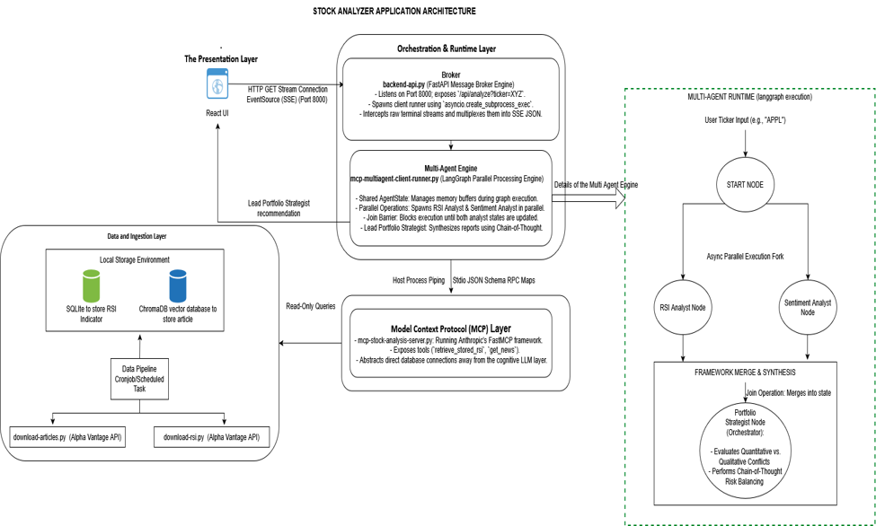
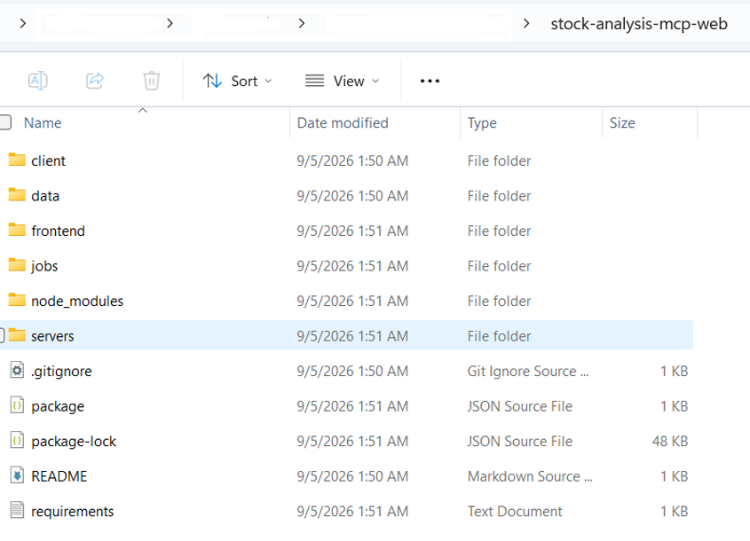

# stock-analysis-mcp-web
## Final system architecture:
The Stock Analyzer Agentic AI application has a multi-agent architecture which is structured as a decoupled, stateful data pipeline designed around a Parallel Processing pattern and powered by the Model Context Protocol (MCP).

The entire architecture is broken down into four distinct, specialized layers:

### 1. The Presentation Layer
This is the user interface (React UI) where the data begins and ends.
*	The Action: The selects a stock ticker from the drop-down menu (e.g. GOOG).
*	The Experience: A real-time Stream Log Terminal displays live, cascading logs showing exactly what the AI agents are thinking at that exact second. Once finished, a Rich Report Container cleanly renders the final BUY, SELL, or HOLD verdict.

### 2. The Orchestration & Runtime Layer
This layer acts as the central brain and communications broker for the agents.
*	The Broker (backend-api.py): A FastAPI server that catches the frontend request, spins up the multi-agent engine, and captures text streams to send back to the user's screen instantly.
*	The Multi-Agent Engine (mcp-multiagent-client-runner.py): When a user requests a stock analysis, LangGraph initializes a centralized, thread-safe dictionary called the AgentState.
 *a.	Parallel Processing: Instead of processing tasks one after the other, the graph dynamically splits into two independent tracks. The RSI Analyst Agent and the Sentiment Analyst Agent spin up concurrently in parallel execution streams.
 *b.	Separation of Concerns: Each agent is completely isolated. The RSI Analyst only cares about quantitative overbought/oversold technicals, while the Sentiment Analyst focuses strictly on news trends and risks. They do not know about each other's work, which keeps their prompt context small and highly accurate.
 *c.	Lead Portfolio Strategist (The Orchestrator Agent): Once both parallel sub-agents receive their raw data from the MCP layer, they synthesize their findings and write them back into the shared AgentState. LangGraph blocks the graph from moving forward until both sub-agents are finished. Once both variables (rsi_data and sentiment_data) are populated, the graph triggers a Join operation and passes the consolidated state to the Lead Portfolio Strategist (Orchestrator). The Strategist reviews the conflicting technical vs. fundamental forces using a Chain-of-Thought structure, balances the risks, and prints the final unified market action: BUY, SELL, or HOLD.

### 3. Model Context Protocol (MCP) Layer

This layer hosts the Model Context Protocol (MCP) server via mcp-stock-analysis-server.py.

*	The Action: When the sub-agents decide they need data, they do not write complex database queries or handle file paths directly. Instead, they speak to an MCP Server over standard input/output (stdio) streams using JSON RPC.
The MCP Server acts like a secure operating system driver: it exposes the retrieve_stored_rsi and get_stock_news tools, reads the local databases, and securely pipes the structured responses back up to the agents.

### 4. Data and Ingestion Layer
*	The pipeline scripts (download-rsi.py and download-articles.py) run separately from the rest of the application, communicating with the Alpha Vantage API to download stock market data. They handle raw ingestion by structuring RSI indicator inside a local SQLite Database and parsing news titles and summaries into a ChromaDB Vector Store. This layer isolates raw data management from the AI workflows.

Please see the architecture and flow of the Stock Analyzer Agentic AI Application below:

## Build and Run The Project

### 1. Clone Git Repository
Clone the Git repository as shown below: 

'git clone https://github.com/zafarkapadia/stock-analysis-mcp-web.git'

Once the repository is cloned you should see the folders below in stock-analysis-mcp-web folder.  
 
 

### 2. Backend Environment Setup (Python)
Change into the **stock-analysis-mcp-web** directory and create your virtual environment: 

'cd stock-analysis-mcp-web'

'python -m venv .venvstockanalysisweb'

Activate the virtual environment based on your operating system: 
**•	Windows (PowerShell): ):  .\.venvstockanalysisweb\Scripts \Activate.ps1**
**•	Windows (CMD):  .\.venvstockanalysisweb\Scripts\activate**

Locate the requirements.txt inside the **stock-analysis-mcp-web** folder.

Install the dependencies:

'pip install -r requirements.txt'

Note: If you run into a chroma-hnswlib compiler error on Windows, make sure you install the Visual Studio C++ Build Tools and select "Desktop development with C++" before running pip again
Create your .env configuration:

Create a **.env** file inside the **stock-analysis-mcp-web** folder to store your API credentials securely

OPENAI_API_KEY=your_actual_openai_api_key_here

### 3. Frontend Environment Setup (React & Vite)

Return to your root project folder (**stock-analysis-mcp-web**)

'cd frontend'

Install dependencies: 'npm install'

### 4. Running the Complete System

To launch the system, you must keep two terminal windows open simultaneously:

**Terminal 1: Python FastAPI Backend**

Ensure your virtual environment is activated inside the **stock-analysis-mcp-web/** directory and run:

'cd client'

'python backend-api.py'

You should see: INFO: Uvicorn running on http://0.0.0 (Press CTRL+C to quit)

**Terminal 2: React UI Frontend**

Navigate to the frontend/ directory and spin up your development server:

'cd frontend'

'npm run dev'

You should see: ➜ Local: http://localhost:5173/

Run an Analysis:
a.	Open your browser and navigate to http://localhost:5173/
b.	Enter a stock ticker symbol (e.g., AAPL) and click Analyse Ticker.
c.	Watch your sub-agents query your databases and stream information to the UI in real-time!

### 5.	Optional Cronjobs/Windows Task Scheduler Jobs

If you would like to create a cronjob or Windows Task scheduler job, locate the run-ingest-rsi.bat and run-ingest-articles.bat files in the stock-analysis-mcp-web/jobs folder and create wither cronjobs or Windows Task Scheduler jobs for hourly RSI retrieval and daily news articles retrieval. You will also need an Alpha Vantage API Key added to the .env file.
